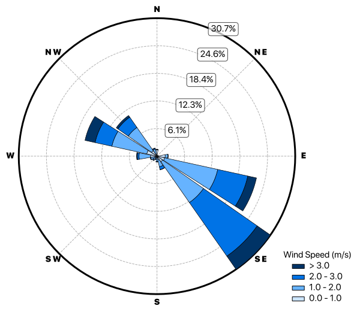
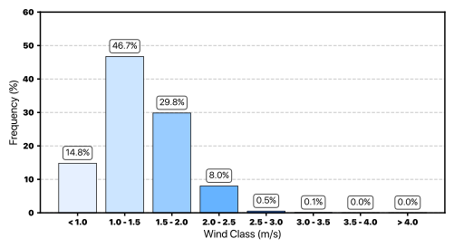

# PhD Data Processing and Analysis Scripts

This repository contains the Python scripts developed for **data acquisition**, **processing**, **analysis** and **visualization** throughout my PhD research.  
They provide a **reproducible workflow** for handling atmospheric and environmental datasets, including:

- Automated retrieval of **TROPOMI** satellite and **MERRA-2** reanalysis products  
- Transformation of raw data into **analysis-ready formats**  
- Calculation of **derived variables** such as tropospheric ozone columns and boundary-layer mixing ratios  
- Generation of **figures and plots** to interpret temporal and spatial patterns  

By sharing these tools, the repository enables other researchers to **replicate, validate and extend** the analyses presented in the thesis.

 

## 1. Data Acquisition (APIs)

Scripts in this group automate the retrieval of remote sensing and reanalysis datasets:

- **`openeo_tropomi_download.py`** – Downloads TROPOMI satellite products through the OpenEO platform.

- **`earthdata_merra2_download.py`** – Downloads MERRA-2 atmospheric variables from NASA Earthdata.

 

## 2. Data Processing and Conversion

These scripts prepare the raw datasets for subsequent analysis:

- **`dataframes_selected_sites.py`** – Extracts data for custom selected sites and organizes it into structured dataframes.

- **`vcds_monthly_means.py`** – Calculates multi-year monthly mean VCDs from individual monthly NetCDF files, producing one NetCDF per month with averaged values and metadata for seasonal and long-term analysis.

- **`netcdf_to_csv.py`** – Converts NetCDF datasets to CSV format for general use or external analysis.

- **`csv_to_netcdf.py`** – Converts CSV-formatted data into NetCDF files suitable for plotting.

 

## 3. Derived Variable Calculation

These scripts combine TROPOMI and MERRA-2 data to derive new atmospheric variables:

- **`pbl_hcho_and_no2.py`** – Computes planetary boundary layer mixing ratios of HCHO and NO2. The script integrates TROPOMI vertical column densities with MERRA-2 PBL heights, interpolating PBLH fields to the TROPOMI grid.
 
- **`tropospheric_ozone_estimation.py`** – Estimates tropospheric ozone columns by scaling TROPOMI total ozone observations using the troposphere-to-total ozone ratio derived from MERRA-2 reanalysis. The script calculates mid-level pressures, identifies tropospheric layers and interpolates the MERRA-2 ratio onto the TROPOMI grid.

 

## 4. Visualization and Statistical Analysis

Scripts in this group generate figures and summary plots used for analysis and interpretation:

- **`seasonal_meteorology_plot.py`** – Generates seasonal and daily time series plots of meteorological parameters (air temperature, relative humidity, air pressure and precipitation). *Example output:*

<figure>
  
</figure>

 

- **`monthly_meteorology_plot.py`** – Produces monthly averaged bar plots of meteorological parameters (air temperature, relative humidity, air pressure and precipitation). *Example output:*

<figure>
  
</figure>

 

- **`windrose_and_distribution.py`** – Creates wind rose diagrams and wind speed distribution histograms. *Example output:*

<figure>
  
</figure>
<figure>
  
</figure>

 

- **`days_with_data.py`** – Calculates and plots the annual number of valid days with TROPOMI data for multiple trace gases at selected sites. *Example output:*

<figure>
  
</figure>

 

- **`seasonal_average_grid.py`** – Generates a 3 x 3 grid of seasonal averages with error bars and smoothed splines, including annual trends for multiple selected sites. *Example output:*

<figure>
  
</figure>

 

- **`hcho_x_no2_x_o3.py`** – Creates a scatter plot of HCHO vs NO2, colored by O3, with reference lines representing FNR thresholds. *Example output:*

<figure>
  
</figure>

 

- **`fnr_x_prob_o3.py`** – Plots FNR against ozone exceedance probability with a third-order polynomial fit, 95% confidence interval and peak highlighting. *Example output:*

<figure>
  
</figure>

 

- **`fnr_trends_plot.py`** – Produces multi-panel seasonal trends of HCHO and NO2 across urban, transition and forest areas with error bars and linear regression lines. *Example output:*

<figure>
  
</figure>

 

## Citation

If you use these scripts, please cite my PhD thesis:
> **FREITAS, A. D.**, *Satellite observations of trace gases vertical columns: exploring temporal and spatial complexities*. Thesis (Ph.D. in Meteorology). Institute of Astronomy, Geophysics and Atmospheric Sciences, University of São Paulo, São Paulo, 2026.

 

## License

This repository is released under the **MIT License**, allowing free use, modification and distribution with attribution.

